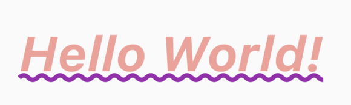

## Project #1 - Creating Your First Flutter App

### Project Creation

Follow the steps below to create your first Flutter project.

1. Open Microsoft's Visual Studio Code
2. Invoke View > Command Palette.
3. Type `flutter`, and select `Flutter: New Project`.
4. Select `Application`.
5. Create or select the parent directory for the new project folder.
6. Enter a project name, such as `helloworld` , and press Enter.
7. Wait for project creation to complete and the main.dart file to appear.

### Hello World App

1. To create your Hello World application, you want to modify the file lib/main.dart.  Replace the contents of the main.dart file with the code below.

```
import "package:flutter/material.dart";

void main() {
  runApp(const HelloWorldApp());
}

class HelloWorldApp extends StatelessWidget {
  const HelloWorldApp
({super.key});

  @override
  Widget build(BuildContext context) {
    return MaterialApp(
      title: 'Welcome to Flutter',
      home: Scaffold(
        appBar: AppBar(
          title: const Text('Welcome to Flutter'),
        ),
        body: const Center(
          child: Text('Hello World!')
        ),
      ),
    );
  }
}
```

2. Run the application.  You should see a screen with a blue app bar along with the text __Hello World!__ centered in the bottom frame.

      

#### Observations

- The application creates a Material app.  [Material](https://material.io/design) is a visual design language this is standard on mobile devices.  Flutter offers a rich set of Material widgets.
- The app extends `StatelessWidget` which makes the app itself a widget.  In Flutter almost every virual componet is a widget that includes alignment, padding, and layout.
- The _Scaffold_ widget provides a default app bar and a body property that holds the widget tree for the home screen.
- A widget's main job is to provide a `build()` method that describes how to display the widget in terms of other lower level widgets.
- The body consists of a `Center` widget containing a `Text` child widget.  The Center widget aligns its widget subtree to the center of the screen.

### Challenge

Use the documentation links to assist you in completing the tasks below.

- [Text class](https://api.flutter.dev/flutter/widgets/Text-class.html)
- [TextStyle class](https://api.flutter.dev/flutter/painting/TextStyle-class.html)
- [4 East Steps to Change Font Family](https://www.flutterbeads.com/change-font-family-flutter/)
- [Google Fonts](https://fonts.google.com/)

The following tasks will ask you to modify the appearence of the __Hello World!__ text.  The tasks are additive, meaning that your final project should implement all of these tasks.

1. Modify the text to be both bold and italic.
2. Modify the text to be red with 50% opacity.
3. Modify the text to have a font size of 50.
4. Modify the text to have an purple wavy underline.

      

#### Advanced

You will find these items a bit more challenging.  These challenges will continue to build upon your project and will again be modifying the appearance of the __Hello World!__ text.

1. Borders
    - Modify the text to remove the wavy purple underline.
    - Modify the text to remove the bolding and italics.
    - Modify the text to be yellow with 100% opacity.
    - Modify the text to have a blue outline with a width of 6.

      

2. Gradient
    - Modify the text to remove the borders.
    - Modify the text to have the color move from green to blue.

      

3. Font Family
    - Download the "Eater" font from Google
    - Modify the text to utilize the Font Family __Eater__.

      


