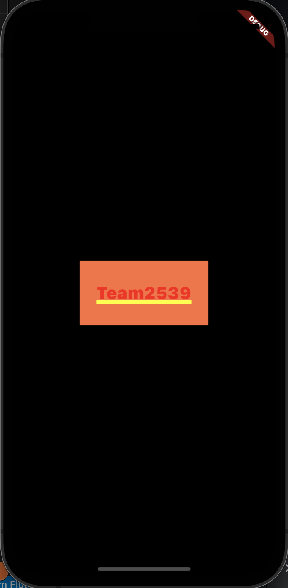
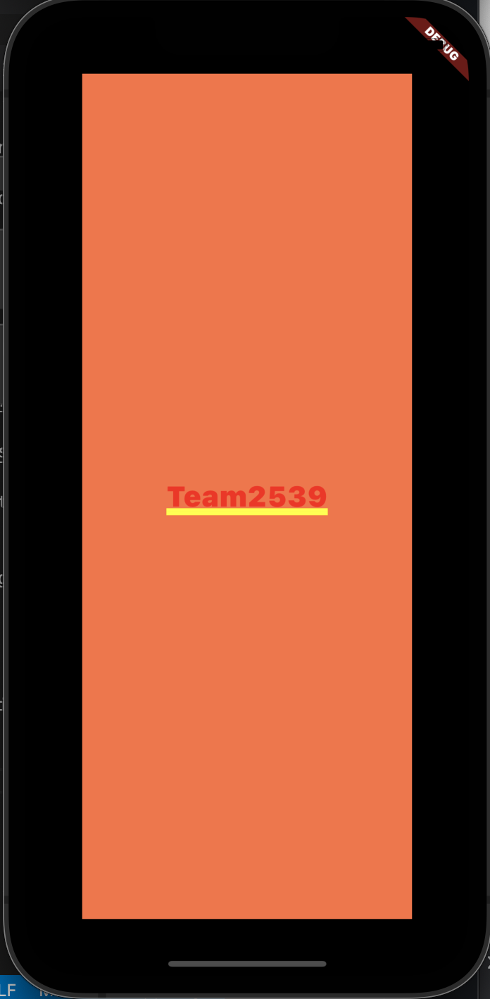
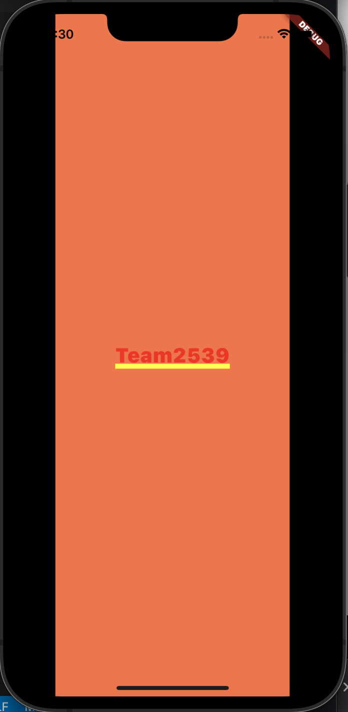
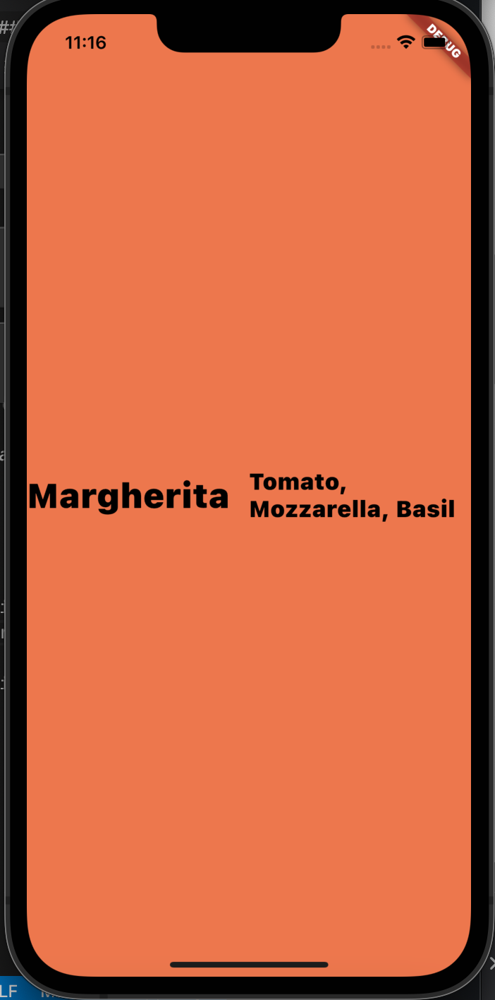
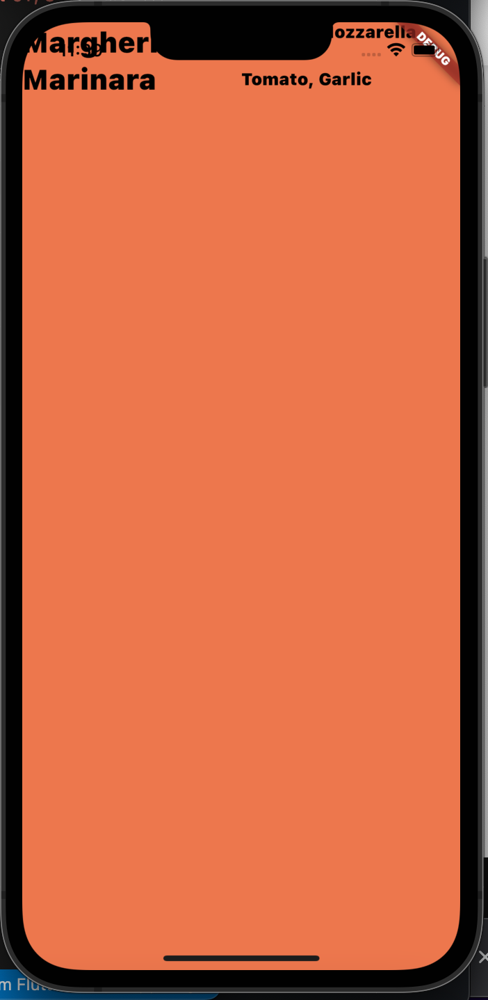
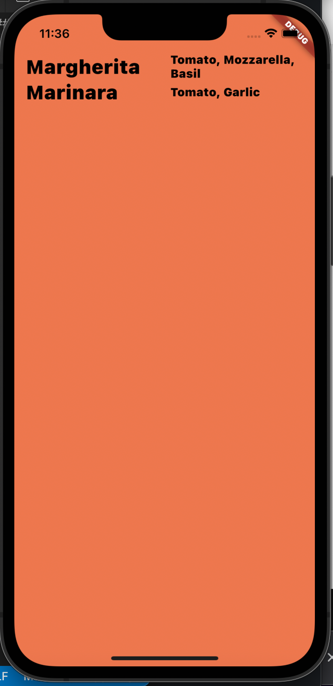

## Project #2 - Layouts App

### Project Creation

Follow the steps below to create your Flutter project.

1. Create a new Flutter project called __Layouts__.

2. To create your Layouts application, you want to modify the file lib/main.dart.  Replace the contents of the main.dart file with the code below.

```
import "package:flutter/material.dart";

void main() {
  runApp(const MaterialApp(
    title: 'Simple Layouts',
    home: Home(),
  ));
}

class Home extends StatelessWidget {
  const Home({super.key});

  @override
  Widget build(BuildContext context) {
    return Container(
      alignment: Alignment.center,
      color: Colors.deepOrangeAccent,
      child: const Text(
        "Team2539",
        style: TextStyle(fontSize: 35),
      )
    );
  }
}
```

3. Run the application.  You should see a deep orange screen with the text __Team2539__ (red with a yellow underline) centered in the screen container.

    


#### Observations

- Some widgets will inherit a minimum and maximum size from its parent widget.  Even though the __Container__ widget has a width and height defined, the container's size fills the screen due to the minimum width/height values inherited from the MaterialApp widget.


### Challenge

Use the class documentation to assist you in completing the tasks below.

- [Container Widget](https://api.flutter.dev/flutter/widgets/Container-class.html)
- [Center Widget](https://api.flutter.dev/flutter/widgets/Center-class.html)

The following tasks will ask you to modify the appearence of the container and the __Team2539__ text.  

1. Modify the size of the container to have a width of 192.0 and height of 96.0 while keeping the text centered in the screen.

    

2. Modify the size of the container to have margins of 50.0 on all sides of the container.

    

3. Modify the size of the container to have margins of 50.0 on left and right sides of the container.

    


#### Advanced

You will find these items a bit more challenging.  Use the class documentation to assist you in completing these tasks.

- [Rows Widget](https://api.flutter.dev/flutter/widgets/Row-class.html)
- [Columns Widget](https://api.flutter.dev/flutter/widgets/Column-class.html)
- [Expanded Widget](https://api.flutter.dev/flutter/widgets/Expanded-class.html)

1. Starting with the original program for project 2 ...
    - Create two __Text__ widgets next to each other.
    - Set the text for the left widget to be _Margherita_ that is colored black and has size 25.
    - Set the text for the right widget to be _Tomato, Mozzarella, Basil_ that is colored black and has size 20.


    

2. Adding onto previous project ...
    - Create two __Text__ widgets that are below the existing Text widgets.
    - Set the text for the left widget to be _Marinara_ that is colored black and has size 25.
    - Set the text for the right widget to be _Tomato, Garlic_ that is colored block and has size 20.
    - __Note:__ _You will notice that your text is no longer centered on the screen._


    

3. Adding onto previous project ...
    - Move the text widgets down the screen by 50.0 and to the left by 15.0.


    
