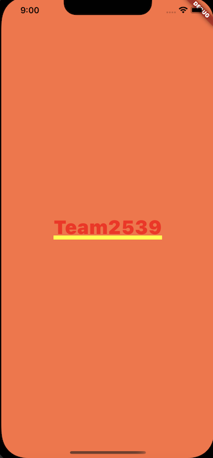

## Project #1 - Layouts App

### Project Creation

Follow the steps below to create your first Flutter project.

1. Create a new Flutter project called __Layouts__.

1. To create your Hello World application, you want to modify the file lib/main.dart.  Replace the contents of the main.dart file with the code below.

```
import "package:flutter/material.dart";

void main() {
  runApp(const MaterialApp(
    title: 'Simple Layouts',
    home: Home(),
  ));
}

class Home extends StatelessWidget {
  const Home({super.key});

  @override
  Widget build(BuildContext context) {
    return Container(
      alignment: Alignment.center,
      color: Colors.deepOrangeAccent,
      width: 192.0,
      height: 96.0,
      child: const Text(
        "Team2539",
        style: TextStyle(fontSize: 35),
      )
    );
  }
}
```

3. Run the application.  You should see a deep orange screen with the text __Team2539__ (red with a yellow underline) centered in the screen container.

    


#### Observations

- Some widgets will inherit a minimum and maximum size from its parent widget.  Even though the __Container__ widget has a width and height defined, the container's size fills the screen due to the minimum width/height values inherited from the MaterialApp widget.


### Challenge

Use the class documentation to assist you in completing the tasks below.

- [Text class](https://api.flutter.dev/flutter/widgets/Text-class.html)
- [TextStyle class](https://api.flutter.dev/flutter/painting/TextStyle-class.html)
- [4 East Steps to Change Font Family](https://www.flutterbeads.com/change-font-family-flutter/)
- [Google Fonts](https://fonts.google.com/)

The following tasks will ask you to modify the appearence of the container and the __Team2539__ text.  

1. Modify the size of the container to have a width of 192.0 and height of 96.0 while keeping the text centered in the screen.

        

2. Modify the text to be red with 50% opacity.

3. Modify the text to have a font size of 50.

4. Modify the text to have an purple wavy underline.

        

