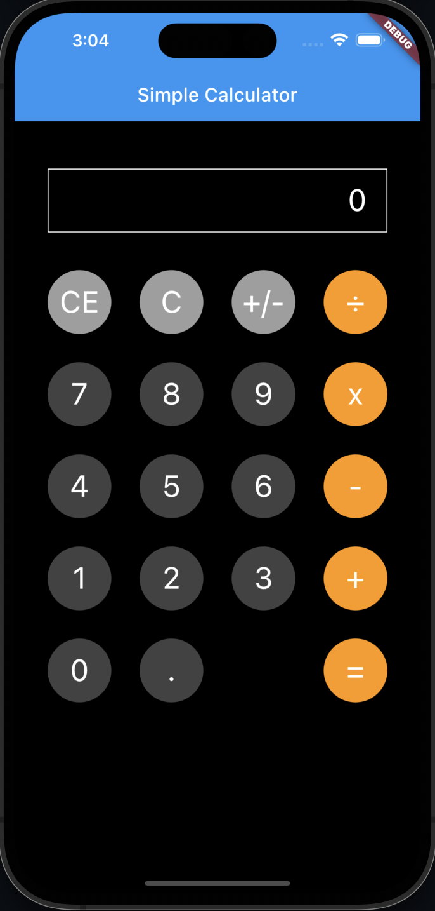

## Project #3 - Simple Calculator Layout App

### Project Creation

Follow the steps below to create your first Flutter project.

1. Create a new Flutter project called __Calculator__.

### Challenge

The challenge is to create a simple calculator application.  When complete,
your running application should look similar to the image below (The next project will
bring your simple calculator to life).

When designing your application, you should think about these items ...

1. You will notice that each of the calculator's buttons look similar.
   You want to think about treating each button as it's own reusable object.

2. When creating reusable objects, it's good to place those objects into their 
   own files.  Objects declared in separate files will require those files to
   be imported into the files referencing those objects.

Use the class documentation to assist you in completing the tasks below.

- [Scaffold Widget](https://api.flutter.dev/flutter/material/Scaffold-class.html)
- [Align Widget](https://api.flutter.dev/flutter/widgets/Align-class.html)
- [CircleAvatar Widget](https://api.flutter.dev/flutter/material/CircleAvatar-class.html)

